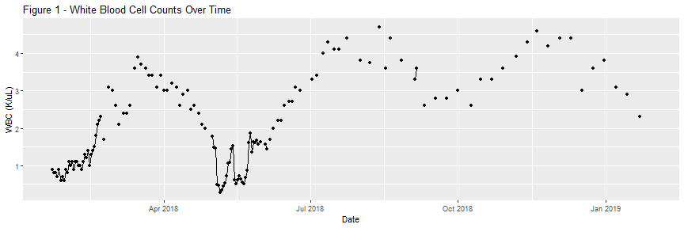
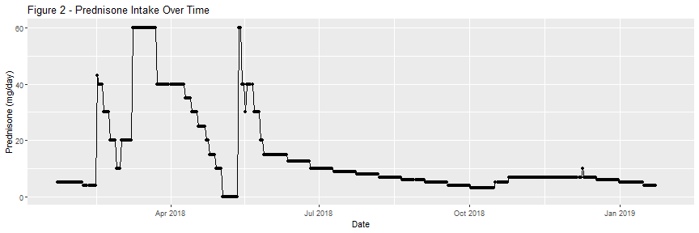
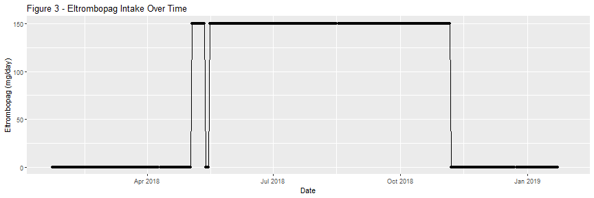
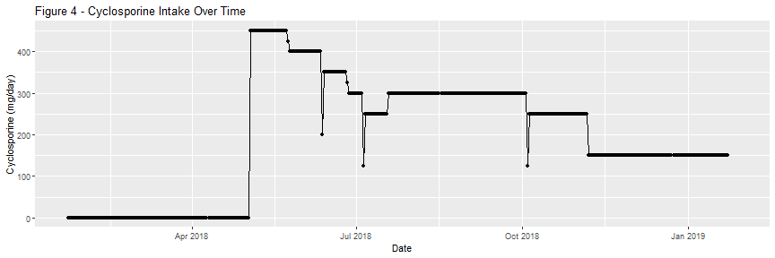
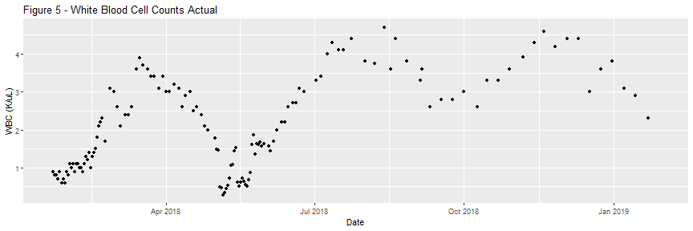
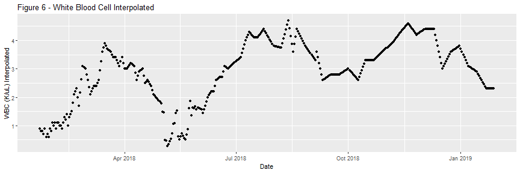

##About
This paper will further examine factors that may contribute to fluctuations in White Blood Cells, and will extend on Spring 2018 findings that Prednisone is highly correlated with White Blood Cell counts in the patient.

## Background

White Blood Cell (WBC) counts trended upwards for the months of January, February, and March 2018, diverging from Red Blood Cell and Platelet counts. This upward trend initially resulted in an assessment that Aplastic Anemia was unlikely. However, bivariate regression analysis of WBCs and Prednisone intake showed a statistically significant correlation (P < .001) and an R Squared of .38 for that three month period of time. Accounting for 60% of the variance in WBC counts per day, the model predicted an increase of .032 (K/uL) WBCs for every additional 1mg of Prednisone. The linear model did not account for infusions.

After further diagnosis, patient was diagnosed with Severe Aplastic Anemia, and admitted to a clinical trial at the National Institute of Health (NIH) in May 2018. The patient received experimental treatment in the form of three medications, H-ATG, Cyclosporine, and Eltrombopag. After treatment, the WBC explanatory model changed dramatically - the increased number of medications while inpatient at NIH appear to have reduced the direct effectiveness of Prednisone on WBCs.

Following the instructions of the clinical trial, the patient stopped taking Eltrombopag on November 6, 2018, and reduced daily Cyclosporine levels to 150mg/day. Additionally, the patient has continued to taper Predisone intake, with a goal of stopping altogether. 



## Hypotheses

This paper will seek to test two hypotheses.

Hypothesis 1: Prednisone does not highly correlate with WBC counts while the patient takes Eltrombopag and Cyclosporine at high doses.

Hypothesis 2: Prednisone does highly correlate with WBC counts once Cyclosporine and Eltrombopag are reduced or discontinued.


# Procedure

This analysis will use linear regression analysis to test for correlations between White Blood Cell Counts (WBCs), and three independent, explanatory variables: Prednisone (mg/day), Eltrombopag (mg/day), and Cyclosporine (mg/day). This section will provide an overview of the data management process, data cleaning and preparation, and the regression test.

#### Data Management, Cleaning, and Preparation

The patient entered medication levels and blood test results into a database starting early 2018. Medication data was entered daily. CBC data was entered daily during hospital stays, and weekly while outpatient. To increase our sample size, we will use interpolation to fill in for missing CBC data. The ImputeTS package will be used, as shown in the following code block.


```r
#Load ImputeTS
library(imputeTS)
#Interpolate NAs and add to a new column in our dataset
HospitalDates$`WBC (K/uL) Interpolated` <- na.interpolation(HospitalDates$`WBC (K/uL)`)

#Plot actual WBC counts over time
ggplot(data=HospitalDates, aes(x=Date, y= `WBC (K/uL)`)) + geom_point() + labs(title = "Figure 5 - White Blood Cell Counts Actual")
```



```r
#Plot interpolated WBC counts over time
ggplot(data=HospitalDates, aes(x=Date, y= `WBC (K/uL) Interpolated`)) + geom_point() + labs(title = "Figure 6 - White Blood Cell Interpolated")
```



To test our hypotheses, we will subset our data into three time periods: 1) May 7 - November 7, 2018, 2) November 7 - Present, and 3) September 1 - Present. The first time period is the height of the clinical trial, during which the patient received varying levels of Cyclosporine and Prednisone, and a constant dose of Eltrombopage (150mg). The second time period is the beginning of the maintenance dosage of medication, during which the patient ended Eltrombopag, lowered the cyclosporine dose, and tapered Prednisone levels. The third time period captures both periods that include Eltrombopag and higher doses of Cyclosporine, but are removed from the major period of blood infusions.


```r
#Subset data to clinial trial
ClinicalTrialDates <- filter(HospitalDates, Date >= "2018-05-06" & Date <= "2018-11-06")

#Subset data to maintenance dose
PostEltrombopagDates <- filter(HospitalDates, Date >= "2018-11-07")

#Subset data to maintenance dose
PostThreeMonthCheckup <- filter(HospitalDates, Date >= "2018-09-01")
```

With two distinct daasets ready, we will build two models.

Model 1 includes all three medications as independent variables, while Model 2 includes only Prednisone. This decision is made due to the presence of variance of the IVs durign Period 1, while there is no variance in Eltrombopag or Cyclosproine intake in Period 2. 


```r
#Build Time Period 1 Model
WBCPredEltromCyclofit_TimePeriodOne <- lm(`WBC (K/uL) Interpolated` ~ `Prednisone (mg/day)` + `Eltrombopag (mg/day)` + `Cyclosporine (mg/day)`, data = ClinicalTrialDates)

#Build Time Period 2 Model
WBCPredEltromCyclofit_TimePeriodTwo <- lm(`WBC (K/uL) Interpolated` ~ `Prednisone (mg/day)`, data = PostEltrombopagDates)

#Build Time Period 3 Model
WBCPredEltromCyclofit_TimePeriodThree <- lm(`WBC (K/uL) Interpolated` ~ `Prednisone (mg/day)` + `Eltrombopag (mg/day)` + `Cyclosporine (mg/day)`, data = PostThreeMonthCheckup)
```

# Results
In this section we will examine the results of the linear model, which aim to test our hypothesis that 1) Prednisone is not a major driver of WBC counts during the height of the clinical trial, and 2) that prednisone is a major driver of WBC counts once other major medications are not taken. 

###Time Period 1: May 6 - November 6, 2018

```
## 
## Call:
## lm(formula = `WBC (K/uL) Interpolated` ~ `Prednisone (mg/day)` + 
##     `Eltrombopag (mg/day)` + `Cyclosporine (mg/day)`, data = ClinicalTrialDates)
## 
## Residuals:
##     Min      1Q  Median      3Q     Max 
## -2.4928 -0.4034 -0.0387  0.4573  1.5147 
## 
## Coefficients:
##                           Estimate Std. Error t value Pr(>|t|)    
## (Intercept)              7.0036672  0.5532209  12.660   <2e-16 ***
## `Prednisone (mg/day)`   -0.0060229  0.0078964  -0.763    0.447    
## `Eltrombopag (mg/day)`  -0.0007932  0.0032585  -0.243    0.808    
## `Cyclosporine (mg/day)` -0.0121906  0.0009391 -12.981   <2e-16 ***
## ---
## Signif. codes:  0 '***' 0.001 '**' 0.01 '*' 0.05 '.' 0.1 ' ' 1
## 
## Residual standard error: 0.6662 on 181 degrees of freedom
## Multiple R-squared:  0.6099,	Adjusted R-squared:  0.6035 
## F-statistic: 94.34 on 3 and 181 DF,  p-value: < 2.2e-16
```

Time period one takes place between May 6 and November 6, 2018. During this time, the patient recieved dozens of medications and regular Red Blood Cell and Platelet Infusions. The results of the model show a significant negative correlation between Cyclosporine and WBCs, and no significant relationship between Eltrombopag or Prednisone and WBCs. The model shows that for every additional milligram of Cyclosporine, we can expect a 0.012 decrease in WBC count.

###Time Period 2: November 7, 2018 - Present

```
## 
## Call:
## lm(formula = `WBC (K/uL) Interpolated` ~ `Prednisone (mg/day)`, 
##     data = PostEltrombopagDates)
## 
## Residuals:
##      Min       1Q   Median       3Q      Max 
## -1.21433 -0.15605  0.07146  0.24644  0.56791 
## 
## Coefficients:
##                       Estimate Std. Error t value Pr(>|t|)    
## (Intercept)            0.64986    0.21359   3.043  0.00322 ** 
## `Prednisone (mg/day)`  0.49645    0.03406  14.575  < 2e-16 ***
## ---
## Signif. codes:  0 '***' 0.001 '**' 0.01 '*' 0.05 '.' 0.1 ' ' 1
## 
## Residual standard error: 0.342 on 76 degrees of freedom
##   (5 observations deleted due to missingness)
## Multiple R-squared:  0.7365,	Adjusted R-squared:  0.733 
## F-statistic: 212.4 on 1 and 76 DF,  p-value: < 2.2e-16
```
Time period two takes place from November 7 to present. During this time, the patient received no infusions, stopped taking Eltrombopag, and reduced daily Cyclosporine intake. The results of the model show a highly significant positive correlation between Prednisone and WBCs. The model shows that for every additional milligram of Prednisone, we can expect a 0.5 increase in WBC (K/uL).

###Time Period 3: September 1, 2018 - Present


```
## 
## Call:
## lm(formula = `WBC (K/uL) Interpolated` ~ `Prednisone (mg/day)` + 
##     `Eltrombopag (mg/day)` + `Cyclosporine (mg/day)`, data = PostThreeMonthCheckup)
## 
## Residuals:
##      Min       1Q   Median       3Q      Max 
## -0.98739 -0.29315  0.03075  0.25690  0.69339 
## 
## Coefficients:
##                          Estimate Std. Error t value Pr(>|t|)    
## (Intercept)              2.164861   0.259672   8.337 6.18e-14 ***
## `Prednisone (mg/day)`    0.331324   0.023142  14.317  < 2e-16 ***
## `Eltrombopag (mg/day)`   0.001838   0.001207   1.523    0.130    
## `Cyclosporine (mg/day)` -0.003312   0.001383  -2.395    0.018 *  
## ---
## Signif. codes:  0 '***' 0.001 '**' 0.01 '*' 0.05 '.' 0.1 ' ' 1
## 
## Residual standard error: 0.348 on 141 degrees of freedom
##   (5 observations deleted due to missingness)
## Multiple R-squared:  0.6929,	Adjusted R-squared:  0.6864 
## F-statistic:   106 on 3 and 141 DF,  p-value: < 2.2e-16
```
Time period three takes place from September 1 to present. During this time, the patient received few infusions, but took both Eltrombopag and higher doses of Cyclosporine and Prednisone. The results of the model show a highly significant positive correlation between Prednisone and WBCs, and a somewhat significant negative correlation between Cyclosporine and WBCs. 


#Conclusions

Results of the experiment prove the hypothesis correct. During summer 2018, Prednisone did not appear to correlate with a change with WBCs. Once medications were tapered or removed completely, Prednisone appeared to significatly correlate with WBC counts. Cyclosporine appeared to negatively correlate with WBCs. 

## Predictions
Using the multivariate linear Scenario 2 and 3 models, we can make rough predictions about the patient's WBC counts based on multiple scenarios. The following tables shows predictions based on varying levels of Predisone.

####Model 2 Predictions

| Prednisone (mg/day)| WBC_Prediction|
|-------------------:|--------------:|
|                   1|       1.146310|
|                   2|       1.642756|
|                   3|       2.139202|
|                   4|       2.635648|
|                   5|       3.132095|
|                   6|       3.628541|
|                   7|       4.124987|
|                   8|       4.621434|
|                   9|       5.117880|
|                  10|       5.614326|

####Model 3 Predictions

| Prednisone (mg/day)| Eltrombopag (mg/day)| Cyclosporine (mg/day)| WBC_Prediction|
|-------------------:|--------------------:|---------------------:|--------------:|
|                   1|                    0|                   150|       1.999443|
|                   2|                    0|                   150|       2.330767|
|                   3|                    0|                   150|       2.662091|
|                   4|                    0|                   150|       2.993414|
|                   5|                    0|                   150|       3.324738|
|                   6|                    0|                   150|       3.656061|
|                   7|                    0|                   150|       3.987385|
|                   8|                    0|                   150|       4.318709|
|                   9|                    0|                   150|       4.650032|
|                  10|                    0|                   150|       4.981356|
|                   1|                    0|                     0|       2.496184|
|                   2|                    0|                     0|       2.827508|
|                   3|                    0|                     0|       3.158832|
|                   4|                    0|                     0|       3.490155|
|                   5|                    0|                     0|       3.821479|
|                   6|                    0|                     0|       4.152802|
|                   7|                    0|                     0|       4.484126|
|                   8|                    0|                     0|       4.815450|
|                   9|                    0|                     0|       5.146773|
|                  10|                    0|                     0|       5.478097|
|                   1|                  150|                     0|       2.771862|
|                   2|                  150|                     0|       3.103185|
|                   3|                  150|                     0|       3.434509|
|                   4|                  150|                     0|       3.765833|
|                   5|                  150|                     0|       4.097156|
|                   6|                  150|                     0|       4.428480|
|                   7|                  150|                     0|       4.759803|
|                   8|                  150|                     0|       5.091127|
|                   9|                  150|                     0|       5.422450|
|                  10|                  150|                     0|       5.753774|
|                   1|                  150|                   150|       2.275121|
|                   2|                  150|                   150|       2.606444|
|                   3|                  150|                   150|       2.937768|
|                   4|                  150|                   150|       3.269092|
|                   5|                  150|                   150|       3.600415|
|                   6|                  150|                   150|       3.931739|
|                   7|                  150|                   150|       4.263062|
|                   8|                  150|                   150|       4.594386|
|                   9|                  150|                   150|       4.925709|
|                  10|                  150|                   150|       5.257033|

